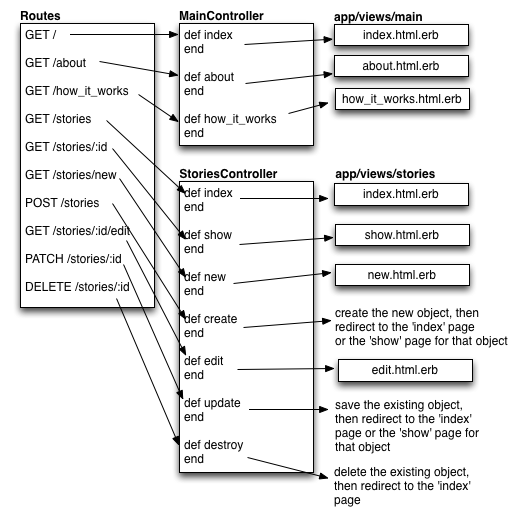
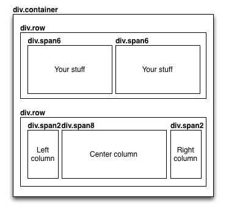

# Class Notes

Here's what we talked about in class on Thursday the 7th.

If at any time you want more details, see the [Rails Guides](http://guides.rubyonrails.org/).

## Starting a New App

	$ rails new <my_app_name>
	$ cd <my_app_name>
	
### If you're in Ubuntu Linux
	$ subl Gemfile
	
	[ add these lines to the bottom ]	
	
	gem 'execjs'
	gem 'therubyracer'

	$ bundle install
		
### Starting the server
	
[ go to another terminal ]

	$ cd <my_app_name>
	$ rails server
	
[ go to your browser ]
	
	http://localhost:3000
	
## Adding Twitter Bootstrap

Twitter Bootstrap is a rich package of CSS (Cascading Style Sheets) classes and Javascript modules that allow you to:

* easily create common web page elements like navbars, menus, and hero units
* align things side-by-side using a simple column grid
* do dropdowns, modal popups, etc

We're using Bootstrap 2 for this class. [Read the docs and see examples here](http://getbootstrap.com/2.3.2/)

There's a version of Bootstrap packaged as a Gem here:

[https://github.com/seyhunak/twitter-bootstrap-rails](https://github.com/seyhunak/twitter-bootstrap-rails)

### To install Bootstrap into your app

	$ subl Gemfile
	
	[add these lines to the bottom]

	gem "therubyracer"
	gem "less-rails"
	gem "twitter-bootstrap-rails"
	
	$ bundle install

	$ rails generate bootstrap:install less

	[ Find your Rails server terminal, hit Ctrl-C to kill it, then run it again ]
	
	$ rails server
	
You'll have to do this for each new app you create.

## Creating your homepage, and other new pages

I'm introducing 3 key concepts in Rails, and you'll need to understand how they work together in order to make a page.

### 1. Routes
### 2. Controllers
### 3. Views

Each *route* connects a URL path (like "/" or "/about" or "/how_it_works" ) to a specific *action method* (like "def index" or "def about" or "def how_it_works") inside of a specific *controller* (like MainController).

Then, each *action method* inside of a specific *controller* has an associated *view*, which is a HTML template.

When the user goes to a URL on your server, Rails will:

1. Check if there's a route for that URL.
2. If so, load the controller class you specified in the route, and run the method you specified in the route from beginning to end
3. After running the method, load the view that goes along with that method, and go through it from beginning to end, rendering HTML and filling in data inside of "template tags".

Here's a diagram:

## Making a new controller

I typically make a controller called "main" first.

	$ rails generate controller main
	
Each controller class lives in `app/controllers/<your_controller_name>_controller.rb`

	$ subl app/controllers/main_controller.rb
	
## Making a new action method

Add a method to your controller class. It can be empty to start.

	def index
	end
	
## Making a new route

The routes all live in `config/routes.rb`.

	$ subl config/routes.rb
	
	… do
		root 'main#index'   <-- each route is added as a line like this
		get 'about' => 'main#about'
		get 'how_it_works' => 'main#how_it_works'
	end
	
The "root" route refers to "/", the homepage of the site.
Each other "get" route refers to a different page.
You specify the controller and method inside the second string, like this 

	'<controller_name>#<method_name>'
	
## Making a new view

The view templates are organized by controller. For a controller called 'main', the controllers live in `app/views/main`.

For each *action method* you make, you'll need to add a file with the same name as the method, followed by `.html.erb`.

	$ subl app/views/main/index.html.erb
	
Put your HTML code into this file.

Now try loading those URLs in your browser.

Now make more views:

	$ subl app/views/main/about.html.erb
	$ subl app/views/main/how_it_work.html.erb

Views contain regular HTML, and template tags that let you create dynamic content.

	<h1>Regular HTML</h1>
	<%= (stuff in here is run as ruby code and inserted into the document) %>
	<% (stuff in here is run as ruby code, but not inserted into the document) %>
	
More html

## Styling your views

In Rails, your CSS lives in files under `app/assets/stylesheets`.

By default, your CSS is organized into files by controller, so you'll see `main.css.scss` after you create a new 'main' controller.

Rails automatically loads all the `.css.scss` files in this directory into every page. 

The basic Bootstrap styles might be enough, but if you want to add your own custom CSS, add it in these files.

## Adding images

In Rails, your image files (.jpg, .png) live under `app/assets/images`.

To add an image, copy it here. You can put it in a subdirectory.

Let's say we put in an image called `rock-paper-scissors.jpg` under the `games` subdirectory of `app/assets/images`.

To include it into a HTML document, use the "image_path" helper, like this:

	
Some html…

	">
	
Some more html…

	
Rails will automatically replace that with the correct path to your image.

## Adding links between pages

When you're writing simple HTML pages, you link to a new page like this:

	<a href="/about">About Us</a>
	
In Rails, you should use the "path helpers" to link between pages instead.

Each route in your `routes.rb` file has a name. You can see the name by running `rake routes` at your terminal in your app directory.

	$ rake routes
	      Prefix Verb URI Pattern             Controller#Action
            root GET /                       main#index
           about GET /about(.:format)        main#about
	how_it_works GET /how_it_works(.:format) main#how_it_works

The name under the `Prefix` column is the name of the route. Add `_path` to the end to get the "path helper" for that route.

So to link to the "about" page, you'd write:

	<a href="<%= about_path %>">About Us</a>
	
Rails will replace that with the correct path to the "about" page.

## Basic styling with Bootstrap

Start by wrapping every page inside of a Bootstrap "container" div.

	

		Your code here…
	

This gives you nice margins that adapt to the width of the browser.

Bootstrap provides a 12-column grid. You'll construct your page out of "row" divs, and inside each "row" div, you'll have one or more "span" divs side by side. The number of the span (span6, span4, span10, etc) indicates how many columns the span should occupy.

This becomes, in HTML code:
	
	

		

			Your Left-Column HTML
		

		

			Your Right-Column HTML
		

	

You can have more than 2 spans in a row, BTW:

	

		

			Skinny left column
		

		

			Wide center column
		

		

			Skinny right column
		

	

		
To make a common navigation bar, use this sample code:

	

  		

    		<a class="brand" href="#">Title</a>
    		<ul class="nav">
      			<li class="active"><a href="#">Home</a></li>
      			<li><a href="#">Link</a></li>
      			<li><a href="#">Link</a></li>
    		</ul>
 		

	

For more information, [read the Bootstrap docs!](http://getbootstrap.com/2.3.2/index.html).

## Placing common elements onto every page

Let's say you're doing a navbar. You want to have that navbar on every page. Don't just copy it into each HTML view template!

Rails provides a mechanism called "layouts" to capture common HTML elements that occur on every page.

Your primary layout lives in `app/views/layouts/application.html.erb`.

	$ subl app/views/layouts/application.html.erb

Here, you can see the default HTML header and the enclosing <body> tags that are on every page. This line gets replaced with the view template for the specific action method that's being called:

	<%= yield %>
	
If you want to wrap a Bootstrap "container" div around every element on the page (and you should!) you do it in the `application.html.erb` file like this:

	

		<%= yield %>
	

	
And if you want to put a navbar at the top of every page:

	

		

			

				<a class="brand" href="<%= root_path %>">Games on Rails</a>
				<ul class="nav">
					<li>
						<a href="<%= about_path %>">About Me</a>
					</li>
					<li>
						<a href="<%= how_it_works_path %>">How it Works</a>
					</li>
				</ul>
			
		
		

		<%= yield %>
	

	
For a simple dynamic navbar that highlights the page you're on, you can include an "if" in your statement that checks whether the current page matches a specific controller and action, and includes the Bootstrap "active" CSS class if so. There are cleaner ways to do this by writing a helper method, but we'll get to that soon.

	

		

			

				<a class="brand" href="<%= root_path %>">Games on Rails</a>
				<ul class="nav">
					<li 
						<% if params[:controller] == "main" and params[:action] == "about" %> 
						class="active"
						<% end %>
					>
						<a href="<%= about_path %>">About Me</a>
					</li>
					<li
						<% if params[:controller] == "main" and params[:action] == "how_it_works" %> 
						class="active"
						<% end %>
					>
						<a href="<%= how_it_works_path %>">How it Works</a>
					</li>
				</ul>
			
		
		

		<%= yield %>

	

# Pushing to Heroku

To push your app to Heroku and place it live on the Internet, you'll have to first make a git repository that contains your app (and only your app). Make sure your app isn't already located inside of a directory that is another git repository.

	$ cd <my_app_dir>
	$ git init .
	$ git add .
	$ git commit -m "Initial import of my app"
	
Then, create a new app on Heroku. Make sure you're in your app directory when you do this.

	$ heroku create
	
	Creating secret-hamlet-4385... done, stack is cedar
	http://secret-hamlet-4385.herokuapp.com/ | git@heroku.com:secret-hamlet-4385.git
	Git remote heroku added

Then, make a few tweaks to your app that you'll need to do before pushing it up to heroku.

	$ subl Gemfile
	
Add this line to the top:
	
	ruby '2.0.0'

Add these lines to the bottom:

	gem 'rails_12factor', :group => :production
	gem 'pg', :group => :production

Find this line:

	gem 'sqlite3'

Change it to look like this:

	gem 'sqlite3', :group => [:development, :test]

Save your Gemfile, then run:

	$ bundle install
	
Then add and commit again:

	$ git add .
	$ git commit -m "Made Gemfile changes for Heroku"

Then, push it to Heroku:

	$ git push heroku master
	
	Counting objects: 100, done.
	Delta compression using up to 4 threads.
	Compressing objects: 100% (92/92), done.
	Writing objects: 100% (100/100), 2.81 MiB | 103 KiB/s, done.
	Total 100 (delta 7), reused 0 (delta 0)

	-----> Ruby app detected
	-----> Compiling Ruby/Rails
	-----> Using Ruby version: ruby-2.0.0
	…
	-----> Launching... done, v5
   		   http://secret-hamlet-4385.herokuapp.com deployed to Heroku

After pushing your app to Heroku, make sure to run the database migrations to set up your database on Heroku.

	$ heroku run rake db:migrate

Now, check it out in your browser:

	http://secret-hamlet-4385.herokuapp.com
	
After making changes to your app, commit the changes and push to heroku again to update the version running out there on the real server:

	$ git add .
	$ git commit -m "My changes"
	$ git push heroku master

Then, run the migrations again:

	$ heroku run rake db:migrate
	
Wait a minute, and bam! The new version is up!

If you know you haven't committed any new migrations, then you can skip the `heroku run rake db:migrate` step.

If you want me to be able to see your app, you should also create a new GitHub repository, and push it up to GitHub too. Heroku is just to run the app. GitHub is to store the code and enable collaboration. 

## Fixing Postgres Installation on Ubuntu Linux

If you get an error when running 'bundle install' about 'pg', then run
	
	$ sudo apt-get install libpq-dev
	
	Enter your linux user password when asked
	
Then run 'bundle install' again.

# Next Class: Resourceful Routes and Dynamic Pages

I hinted at this in the "routes" diagram above, but I'll be introducing the core pattern that you'll be using to structure the dynamic parts of your Rails apps going forward.

 
