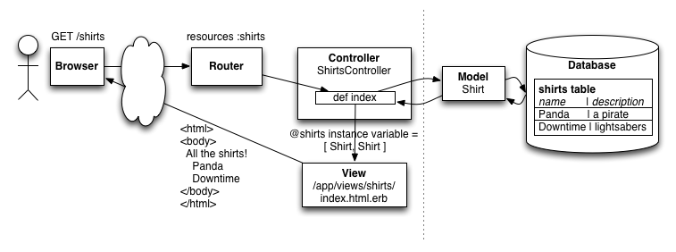

# Class Notes

# Databases, Models and Resources

Here's our view of the world so far:

We've learned about everything on the left side of the dashed line already.

You know how to set up routes, accept requests from the browser, handle them with a controller action method, and render the view for that action.

But, none of this allows you to *store* data persistently, so your apps are limited to single-player apps like games. You can't do any collaboration tools, multi-user apps, etc, without storing and retrieving data. 

Today, we'll be learning about how we store and retrieve persistent data in Rails.

But first, let's remember **CRUD** for a moment:

* Create (make a new airbnb room)
* Retrieve (get the list of rooms, get an individual room's details)
* Update (change your airbnb room)
* Delete (delete your airbnb room after you're sick of all the guests)

Or in the case of our **Shirts** app:

* Create a new shirt
* Retrieve a list of shirts, retrieve an individual shirt
* Update an existing shirt
* Delete a shirt

So far, we've been building from the left to the right in that diagram. Today, we'll start by building from the right to the left, until they meet in the middle.

## Databases

Rails is designed to use SQL databases to store data. A SQL database (which stands for Structured Query Language) is a time-tested and proven model for storing large quantities of data.

A database is like an Excel spreadsheet with lots of tabs.

Each tab is called a "table". Each table is meant to store a particular kind of object, like a room (in a "rooms" table) or a tweet (in a "tweets" table) or a shirt (in a "shirts" table).

Each row in the table represents an individual shirt, room, or tweet. There could be just a few rows in a table, or there could be millions of rows.

Each table has a list of columns, and each column has a name like "title", "description", "price", etc (like a header row in Excel). This means that each row stores attributes of the object (the name of the room, the description of the room, the price of the room, etc). 

Each column also has a datatype, indicating what kind of data is allowed to be in that column. This is different from Ruby, where any variable can hold any type.

The typical datatypes are:

* string (for a short piece of text less than 255 chars)
* text (for a long piece of text of any length)
* integer (for a regular number with no decimal points)
* decimal (for a number with a decimal point)
* float (for a number with a decimal point, but less precise and faster)
* datetime (for a date and a time!)

Here's how you use the database from your app:

* when the user wants to see a list of all the shirts, you ask the database for all the rows in the 'shirts' table

* when the user wants to see the details for an individual shirt, you ask the database for an individual row from the 'shirts' table. 

* when the user wants to create a new shirt, you add a new row to the 'shirts' table

* when the user wants to update a shirt, you look up an existing row in the 'shirts' table, change one or more of the cells, and save it back to the database

* when the user wants to delete a shirt, you look up an existing row in the 'shirts' table, then you delete that row

Once you get to multiple models (say, 'shirts', 'users', and 'comments'), you'll just have multiple tables in your database.

In development, your app will be using SQLite as its database because it's simple and requires no setup. A SQLite database (including all the tables) is stored in a single regular file in your app directory (under db/development.sqlite3).

In production on Heroku, your app will be using Postgres as its database because Postgres supports multiple web app servers and is designed for high traffic use. A Postgres database is stored in a set of internal files with a server in front of it. Heroku will manage all that for you, and will automatically connect your app to that database when you push it to production.

Rails will handle most of the database details for you. For as far as we'll get in this class, it shouldn't matter whether you're storing data in SQLite or Postgres as long as you use the models (next section).

## Models

But how do we talk to the database from Rails?

We do it by creating ActiveRecord Model classes.

You create one model class for each table in your database. Remember the Reddit Story class and Comment class? Those were like model classes, except they didn't have a database behind them. In Rails, the ActiveRecord model makes it easy to create model classes that have a database behind them.

The attributes of the model class are automatically defined to have the same names as the database columns. Remember the attr_accessor :title stuff from Reddit? In your model classes, that's done automatically for you based on the database.

Then:

* when you ask the database for all the shirts, you actually get an array of Shirt objects to work with in your code.

* when you look up a particular shirt, you get a single Shirt object. 

* when you want to create an new shirt, you make a new Shirt object, set the attributes, and save it to the database

* when you want to update a shirt, you look up a Shirt object, change its attributes, and save it back to the database

* when you want to delete a shirt, you look up a Shirt object, and destroy it

### Creating Models

When you want to define a new database table and model class, you use the Rails "model" generator:

	rails generate model <name_of_model> <column_1>:<type_of_column_1> <column_2:type_of_column_2> …
	
So if you're making a shirt model, you run:

	rails generate model shirt name:string description:text
	
**NOTE: model names are _singular_ and _lowercase_**

This generates a model class in `app/models/shirt.rb` and a *migration* in `db/migrate/<current_dateandtime>_create_shirts.rb`.

## Migrations

A migration is a recipe for modifying a database.

Instead of tweaking the database directly, you create migrations to do it for you.

That's beacuse you have more than one database. You have your local development database, which is stored in `db/development.sqlite3` and you have your remote production database on Heroku. 

If you had to update them both by hand, create tables, add columns, rename columns, etc, you'd probably mess up somewhere down the line and they'd get out of sync.

If you write instructions, then you can always have Rails just follow the instructions and update your database for you.

### Running Migrations

Take a look at the migration class that gets generated.

	class CreateShirts < ActiveRecord::Migration
	  def change
	    create_table :shirts do |t|
	      t.string :name
	      t.text :description

	      t.timestamps
	    end
	  end
	end

These instructions are pretty close to English. 

> Make a table called shirts. Create a 'name' column with type string. Create a 'description' column with type text. Create some timestamp columns. 
	
The timestamps are a 'created_at' column with type datetime and an 'updated_at' column with type datetime, which rails uses to track when each row was created and when each row was last updated. This will come in handly later.

To run all migrations in the `db/migrate` directory, run this at the terminal:

	rake db:migrate
	
This will modify your database until all the instructions have been run, creating tables, adding columns, deleting columns, etc.

If you run it again:

	rake db:migrate
	
Nothing will happen because your database is already up-to-date with the instructions.

### Adding Migrations

Let's say you want to add a new column to your `shirts` table to hold the filename of an image for the shirt.

In general, you can't just go back and edit your old migration. You've already run it. The table is already there, and you can't create it again.

So, you make a *new* migration to add the new column, using a new Rails generator.

	rails generate migration add_image_to_shirts image:string
	
When you're naming your migrations, if you name them `add_???_to_<tablename>`, Rails will do the right thing and make instructions to add columns to a table. Then, you specify a list of column names and types to add to your table.

	class AddImageToShirts < ActiveRecord::Migration
	  def change
	    add_column :shirts, :image, :string
	  end
	end
	
Then the next time you run:

	rake db:migrate
	
The shirts table in your database will gain an `image` column, and the cells will be empty for all the rows already in that table.

For more on migrations, read the Rails Guides on [Active Record Migrations](http://guides.rubyonrails.org/migrations.html).

### Viewing your database

Download [SQLite Database Browser](http://sourceforge.net/projects/sqlitebrowser/).

Open this file:

	<your_app_dir>/db/development.sqlite3
	
That's your database!

Keep refreshing the Database Browser as you use your database. You'll see all your columns and data.	

### Fixing a messed up migration

Let's say you make a model but spell the name wrong, or spell a column name wrong, etc.

You can destroy a model or migration by running:

	rails destroy model <name>
	
Or

	rails destroy migration <name>
	
This will delete the generated files.

Then you can create it again from scratch.

### Fixing a messed up database

Let's say you mess up your database. You can always delete it and start over by running these commands at the terminal:

	rake db:drop
	rake db:create
	
This makes a new empty database with no tables.

Then you can apply all your migration instructions again:

	rake db:migrate
	
And the tables are all good as new, and all your old data is gone.

## Rails Console

Now that we've defined models, we can use them to work with our database from our app code - in controllers and in other models. We'll get to that in a sec.

But we can also use models to interactively examine and change our database outside of our app. This is great for administration.

You can connect to your database by running the "rails console". Run this at your terminal.

	rails console
	
To get out, type:
	
	exit
	
This is an interactive Ruby environment, and everything from your Rails app is available here.

You can write Ruby code here, just like you would in your controller, but it executes immediately after you hit enter.

	2.0.0p247 :001 > x = 2
 	=> 2 
	2.0.0p247 :002 > y = 3
    => 3 
	2.0.0p247 :003 > z = x+y
	=> 5 
	2.0.0p247 :004 > puts z
	5
	=> nil
	
## Working with Models

Every model, like `Shirt`, has the same methods available to work it. I'll use `Shirt` as an example here, but the models you create will all work the same way.

The only differences are the actual attributes that you create for your own model.

You can execute all these commands in the `rails console`, or in your Rails app code itself.

### Getting a list of model objects

Get all the objects in the `shirts` table with `Shirt.all`. This is a "class method", so you call it on the Shirt class itself, not on any particular shirt object.
	
	shirts = Shirt.all
	
You get:

	[]

That's because there are no shirts in the database yet.

But run `Shirt.all` again after doing some of the creation stuff next.

### Creating a new model object

To create a new shirt and save it into the database in one operation, use the `Shirt.create` method.

	new_shirt = Shirt.create( :name => "Downtime", :description => "lightsabers", :image => "downtime.png" )
	
This method takes a hash as its argument, and each key in the hash is the name of a column in the database (and attribute of the object). The values in the hash are the values you want to save into the database.

You can also create and save a new shirt in a multiple-step way:

	new_shirt = Shirt.new
	new_shirt.name = "Downtime"
	new_shirt.description = "lightsabers"
	new_shirt.save
	
These two ways of doing it are basically the same, and you get a new shirt object:

	#<Shirt id: 1, name: "Downtime", description: "lightsabers", created_at: "2013-11-15 02:38:39", updated_at: "2013-11-15 02:38:39", image: "downtime.png">

### Looking up a model object

Every Rails model also gets an `id` column automatically. This column is filled in with a new unique number for every object you create. That makes it a unique ID for any particular object.

You can use that ID to look up any previously created object, so you can get the data out of it, edit it, or delete it.

To do this, you use the `Shirt.find( id )` method:

	my_shirt = Shirt.find( 1 )
	
You get the shirt object again:

	#<Shirt id: 1, name: "Downtime", description: "lightsabers", created_at: "2013-11-15 02:38:39", updated_at: "2013-11-15 02:38:39", image: "downtime.png">

Then you can do:

	puts my_shirt.name	
	"Downtime"
	
If you `find` a different ID, you get a different object.

If you try to look up an object that doesn't exist in the database, you get an error.

### Editing a model object

Once you've called `.find`, you have a model object to play with. 

To edit that object, use `.update` which changes the attributes and saves it:

	my_shirt = Shirt.find( 1 )
	my_shirt.update( :name => "Uptime" )
	
Or, you can do it step-by-step, changing the attributes and then `.save` it.

	my_shirt = Shirt.find( 1 )
	my_shirt.name = "Uptime"
	my_shirt.save

You get:

	#<Shirt id: 1, name: "Uptime", description: "lightsabers", created_at: "2013-11-15 02:38:39", updated_at: "2013-11-15 02:38:39", image: "downtime.png">
	
### Deleting a model object

Once you've called `.find` and gotten an object, you can destroy it too:

	my_shirt = Shirt.find( 1 )
	my_shirt.destroy
	
This removes the row from the database table.

### Querying for model objects

You don't always want `.all` your model objects, right?

#### Limiting your results

Sometimes you only want to get a few model objects.

	some_shirts = Shirt.limit(4)

This gives you up to 4 elements in your `some_shirts` array.

#### Sorting your results
	
	some_shirts = Shirt.order("created_at DESC")
	
#### Chaining queries

You can combine any of these query methods:

	some_shirts = Shirt.order("created_at DESC").limit(4)
	
#### Comparing against individual columns

This gives you all the shirts with a name of "Downtime":

	some_shirts = Shirt.where(:name => "Downtime")

This gives you the first shirt with a name of "Downtime":	
	my_shirt = Shirt.where(:name => "Downtime").first

This compares against multiple columns. It's an AND. All columns must match.

	some_shirts = Shirt.where(:name => "Downtime", :description => "clean")

#### More complex queries

To do a more complex query, you have to stop using hash params in your `.where`, and start using SQL queries.

This does an OR against multiple columns:

	some_shirts = Shirt.where("name = :name_query OR description = :desc_query", :name_query => "Downtime", :desc_query => "clean")
	
Whenever you include values into your SQL queries, you should do it by creating these parameters (`:name_query`, `:desc_query`). See the Rails Guides for more.

#### Search-style queries

When you're searching, you're just looking to see if any word in the column matches, not the whole column. Use `LIKE` to do this:

	some_shirts = Shirt.where("name LIKE :name_query", :name_query => "%time%")
	
The `%` on either side of your query means "with anything before or after the string 'time'".

### Seeding your database

If you want to populate your database with a bunch of data, you can type `.create` calls into the console, or you can write them into a file called 

	db/seeds.rb
	
Then run this at your terminal:

	rake db:seed
	
## Using Models from Controllers

Now, we're getting to the good stuff!

Here's the Rails rule:

> Make one controller per model. Name the controller the same as the model, but plural. Add a resources route for this controller.

### Making a controller

So, to manage our Shirt model, we do

	rails generate controller shirts
	
Edit `config/routes.rb`

	resources :shirts

This gives us the following routes, as usual:

	    shirts GET    /shirts(.:format)          shirts#index
	           POST   /shirts(.:format)          shirts#create
	 new_shirt GET    /shirts/new(.:format)      shirts#new
	edit_shirt GET    /shirts/:id/edit(.:format) shirts#edit
	     shirt GET    /shirts/:id(.:format)      shirts#show
	           PATCH  /shirts/:id(.:format)      shirts#update
	           PUT    /shirts/:id(.:format)      shirts#update
	           DELETE /shirts/:id(.:format)      shirts#destroy
	
We'll start by making our index page that shows all the shirts.

### Making an index Page

Edit `app/controllers/shirts_controller.rb`

	def index
		@shirts = Shirt.all
	end
	
Now we have an array of shirt objects in `@shirts`, thanks to our query.

Edit `app/views/shirts/index.html.erb`

	<ul>
		<% @shirts.each do |shirt| %>
		<li><%= shirt.name %>
		<% end %>
	</ul>

And now you have a list of shirts! Go nuts!

# Next Week: Using forms to create, edit, and delete models through your app.

