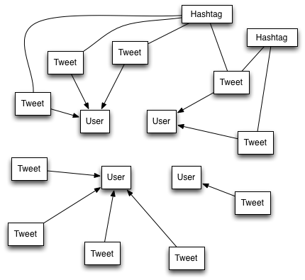
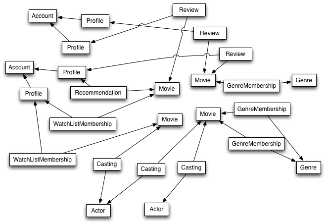
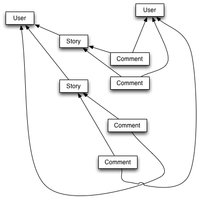

# Class Notes

# Associations

## Or, how to say "these stories were posted by this user, but those stories were posted by that user".

Let's say that when you're printing a Rewsly story, you want to print the username of the user who posted the story. You'll have to store the username as a column of the story when the user posts it.

But what happens if you want to print out a profile pic next to the user who posted the story? You'll have to store that profile pic with the story too.

This gets pretty redundant. We already _have_ a users table - why are we storing that information with the stories also?

And, what if the user changes their username? Then the old stories will say they were posted by a username that doesn't exist anymore.

Oh, but then I can go back and change all the usernames on the stories. But what if they posted thousands of stories? That's a lot of work each time they change their username. Or their profile pic. Or anything else about them.

It's much easier to just store the user information by itself in the users table, with username and profile pic and everything else, and then say "this story was posted by _that user_", and refer to the specific user who posted it.

Then when you're printing out a story, you look up the associated user, then print out their username and profile pic.

That way, when the user changes their username or profile pic, you don't have to go change all the stories.

In general, we can say that each story is associated with a user who posted it, and each user is associated with a bunch of stories that they posted.

> Whenever you have two different "things" in your app that seem related, you'll model that relationship using an "association".

This is a bit of an abstract statement, but we'll be learning a new way of thinking in this lesson.

## General Data Modeling Process

Here's a process that can make it easier to figure out your models and associations:

1. List the models involved in your app. Each model is a noun.
2. Write down 2-3 important attributes for each model
   to clarify what it really does (e.g. "username")
3. Draw your models as a few individual icons (draw _a few_ users, _a few_ reviews, etc)
4. Draw lines between those icons to understand how they're related
5. Think about what "belongs to" what and what "has many" other things
6. Translate those relationships into foreign keys in tables (e.g. tweet.user_id)

## Understanding Associations

We'll start learning about associations by examining Twitter's associations.

Start by writing down your models, and filling in a few example attributes for each one.

### Models

**User**

| id | name | email | username | photo | password |
|:---|:-----|:------|:---------|:------|:---------|
| 23 | Scott Weiner | … | Scott_Weiner | … | … |
| 38 | Mark Suster | … | msuster | … | … |

 
**Tweet**

| id | text | created_at | location |
|:---|:-----|:-----------|:---------|
| 3000 | … Nancy Pelosi … | 6:02pm | … |
| 3001 | … World AIDS Day … | 5:00pm | … |
| 3002 | … DataSift … | 6:15pm | … | 

**Hashtag**

| id | text |
|:---|:-----|
| 12 | #goodnews |
| 15 | #yesterday |

### Drawing Relationships

### Naming Relationships

For each pair of related models, think about they're related.

Try to capture each relationship using these two phrases: "has many" and "belongs to".

#### Tweets and Users

Each user can post a bunch of tweets.

This means that:
 
* A user "has many" tweets associated with it (e.g. none, one, or more than one).
* A tweet "belongs to" a single user.

NO tweet "belongs to" multiple users, so it's a simple "many-to-one" relationship.

#### Tweets and Hashtags

Each user can specify a few hashtags in their tweet when they post it.

This means that:

* A tweet "has many" hashtags associated with it (e.g. none, one, or more than one).
* A hashtag "has many" tweets associated with it (e.g. none, one, or more than one).

In this case, we see a "many-to-many" relationship. This will require a different technique when we translate it into a SQL database.

### Expressing Relationships in SQL

In SQL, following Rails conventions, every model is in its own table, and every table has a unique "id" attribute for every row.

> We express a relationship between a pair of models by adding a column to one table that contains the id of the associated row in the other table.

#### Many-to-one

Because each Tweet "belongs to" a User, we add a column that holds the id of the user it belongs to. This column is named "user_id" because it holds the id of a User row.

**User**

| id | name | email | username | photo | password |
|:---|:-----|:------|:---------|:------|:---------|
| 23 | Scott Wiener | … | Scott_Wiener | … | … |
| 38 | Mark Suster | … | msuster | … | … |

 
**Tweet**

| id | text | created_at | location | user_id |
|:---|:-----|:-----------|:---------|:--------|
| 3000 | … Nancy Pelosi … | 6:02pm | … | 23
| 3001 | … World AIDS Day … | 5:00pm | … | 23
| 3002 | … DataSift … | 6:15pm | … |  38

Now, you can see that tweets 3000 and 3001 were posted by Scott Wiener, and tweet 3002 was posted by Mark Suster.

**NOTE:** All the tweets from all the users are still contained in a *single* table. There isn't "one table for each user's tweets". We rely on the value in the `user_id` column to separate "this user's tweets" from "that user's tweets". There's an "index" on the `user_id` column that allows us to quickly find all of a particular user's tweets, even if the table has millions and millions of tweets from other people in it.

This is the fundamental way we model relationships in a SQL database.

You'll probably be using this technique for most of your relationships.

* A user "has many" stories (that they posted)
* A story "belongs to" a user (who posted it)
* A story "has many" comments (that were posted to it)
* A comment "belongs to" a single story (that it was posted to)
* A user "has many" comments (that they posted, regardless of story)
* A comment "belongs to" a user (who posted it)

The model that "belongs to" another model *always* has a column that contains the key of 
the model it belongs to.

Also note that it's perfectly reasonable for a single model to belong to more than one other model. A comment belongs to a story, but it also belongs to a user who posted it.

#### Many-to-many

If we have a many-to-many relationship, you might think "oh, I'll just put a list of all the hashtags for that tweet into a column" or "oh, I'll just put a list of all the tweets for that hashtag into a column".

Unfortunately, SQL indexes don't work that way. If you find yourself wanting to put a list into a column, you'll want to think of another way to do it. Here's how.

We break up every "many-to-many" relationships into a pair of "many-to-one" relationships by introducing a **new** model in the middle. 

We'll call it a HashtagMembership.

**Tweet**

| id | text | created_at | location |
|:---|:-----|:-----------|:---------|
| 3000 | … Nancy Pelosi … | 6:02pm | … |
| 3001 | … World AIDS Day … | 5:00pm | … |
| 3002 | … DataSift … | 6:15pm | … | 

**Hashtag**

| id | text |
|:---|:-----|
| 12 | #goodnews |
| 15 | #yesterday |

**HashtagMembership**

| id | tweet_id | hashtag_id |
|:---|:---------|:-----------|
| 292 | 3000 | 12 |
| 293 | 3001 | 15 |
| 294 | 3001 | 12 |
| 295 | 3002 | 15 |

Each HashtagMembership captures the fact that "this tweet includes that hashtag".

The "Nancy Pelosi" tweet and the "World AIDS Day" tweet both have the #goodnews hashtag.

The "World AIDS Day" tweet and the "DataSift" tweet both have the #yesterday hashtag.

Now, we can say that:

* A hashtag "has many" hashtag memberships.
* A hashtag membership "belongs to" a single hashtag.

And

* A tweet "has many" hashtag memberships.
* A hashtag membership "belongs to" a single tweet.

When we combine these two, we can say that:

* A hashtag "has many" tweets *through* its hashtag memberships.
* A tweet "has many" hashtags *through* its hashtag memberships.

Now, we can use a SQL index to quickly find all the memberships for a given hashtag, and look up the tweet for each one. This lets us show all the tweets with a specific hashtag.

Or, we can use a SQL index to quickly find all the memberships for a given tweet, and look up the hashtag for each one. This lets us show all the hashtags in a tweet.

You'll probably be using this technique too, but more for things like:

* categories
* genres

But only if a single item can belong to multiple categories or multiple genres. 

If each item can only belong to a single category or single genre, just use the simple many-to-one relationship. Way less painful.

**By the way**, in production sites, you might choose not to put these many-to-many relationships in the database at all. You might just end up storing all the Hashtags inside a string column of the Tweet model, and rely on a third-party search server like Solr to maintain the indexes that let you get all the Tweets for a given Hashtag (or all the products for a given category, etc). But, that's a lesson for another class.

## Netflix Associations

Let's practice by drawing out all the associations in Netflix.

### Models

**Account**

**Profile**

**Movie**

**Review**

**Actor**

**Casting**

**Genre**

**GenreMembership**

**Recommendation**

**WatchListMembership**

### Drawing Associations

### Explaining Associations

Accounts and profiles (many to one)

* An account "has many" profiles, and each profile "belongs to" an account

Profiles, reviews, and movies (many to one and many to one)

* A profile "has many" reviews, and each review "belongs to" a profile
* A movie "has many" reviews, and each review "belongs to" a movie

Watchlists of movies for each profile (many to many)

* A profile "has many" movies through watch list memberships.
* A movie "has many" profiles through watch list memberships.

Recommended movies for each profile (many to many)

* A profile "has many" movies through recommendations.
* A movie "has many" profiles through recommendations.

Actors in movies (many to many)

* A movie "has many" actors through castings.
* An actor "has many" movies through castings.

Genres for movies (many to many)

* A movie "has many" genres through genre memberships.
* A genre "has many" movies through genre memberships.

## Coding Associations

Let's transform our Rewsly app so it keeps track of which user posted each story.

The existing models are simple.

**Story**

| id | title | link | upvotes | category |
|:---|:------|:-----|:--------|:---------|
| 1  | Dog Bites Man | http://i.imgur.com/dogbitesman.jpg | 2 | lessfunny |
| 2  | Man Bites Dog | http://i.imgur.com/manbitesdog.jpg | 100 | funny |
| 3  | Kittens Kittens Kittens | http://i.imgur.com/kittens3.jpg | 2000 | cute |

**User**

| id | email | encrypted_password | … |
|:---|:------|:-------------------|:--|
| 1  | janesmith@gmail.com | … | … |
| 2  | bobsmith@gmail.com | … | … |

The associations are also simple:

* A user "has many" stories
* A story "belongs to" a single user

Just a regular many-to-one relationship.

All we have to do is add a `user_id` column to our `stories` table.

**Story**

| id | title | link | upvotes | category | user_id |
|:---|:------|:-----|:--------|:---------|:--------|
| 1  | Dog Bites Man | http://i.imgur.com/dogbitesman.jpg | 2 | lessfunny | 1 |
| 2  | Man Bites Dog | http://i.imgur.com/manbitesdog.jpg | 100 | funny | 2 |
| 3  | Kittens Kittens Kittens | http://i.imgur.com/kittens3.jpg | 2000 | cute | 1 |

**User**

| id | email | encrypted_password | … |
|:---|:------|:-------------------|:--|
| 1  | janesmith@gmail.com | … | … |
| 2  | bobsmith@gmail.com | … | … |

Now we know which user posted each story.

### Add the Column

You'll do it by creating a new database migration, like usual.

	$ rails generate migration add_user_id_to_stories user_id:integer
	
Look at the migration that gets generated to doublecheck:

	$ subl db/migrate/20131204040917_add_user_id_to_stories.rb

	class AddUserIdToStories < ActiveRecord::Migration
	  def change
	    add_column :stories, :user_id, :integer
	  end
	end

Yep, that's doing the right thing. If it doesn't look like this, maybe you forgot to include the word `_to_` in your migration name, or spelled the `_stories` table wrong. That's ok, you can edit the migration yourself.

One more thing: because this is a foreign key, we'll want to add an index. Change the migration by adding the `add_index` method:

	class AddUserIdToStories < ActiveRecord::Migration
	  def change
	    add_column :stories, :user_id, :integer
	    add_index :stories, :user_id
	  end
	end

Then, save the migration file and run the migrations to update your database:

	$ rake db:migrate
	
Double-check your database in SQLite Explorer. Your 'stories' should each have a new empty column called `user_id`.

That's all we have to do to the database. But, we still have to tell our Rails app about the relationship between these two models.

### Update the Models

You need to define the association in each of the two models.

Since "A story "belongs to" a single user", we need to edit our Story model:

	$ subl app/models/story.rb
	
	class Story < ActiveRecord::Base
		…
		belongs_to :user
		…
	end
	
That's it! The call to the `belongs_to` method with an argument of `:user` creates a new attribute of our Story model called `user`, and expects there to be a `user_id` column to back it up. If these names don't line up, you'll get errors.

Now, when you call the `user` attribute on a Story object associated with User id 2, Rails will automatically query the Users table for a user with id = 2 and return that User model object.

Since "A user "has many" stories", we need to edit our User model too:

	$ subl app/models/user.rb
	
	class User < ActiveRecord::Base
		…
		has_many :stories
		…
	end

That's it as well! The call to the `has_many` method with an argument of `:stories` creates a new attribute of our User model called `stories`. 

There's no column in the `users` table backing up the `has_many` association, but when you access the `stories` attribute of a User with id 2, Rails will automatically query the `stories` table for all stories with an associated `user_id` of 2 and return them as an array. 

Bam, you have all the stories that this user posted.

### Use the Model Associations

Now that you've added `belongs_to :user` to Story… 

Just like you use the `title` attribute to get and set the title of the story, you'll now be able to use the `user` attribute to get and set the associated user for the story. 

You can imagine that the `user` attribute of a Story actually holds a User model object inside it, except that Rails automatically looks up that model object in the `users` table according to the number in the `user_id` column for that Story.

And, when you set the `user` attribute of a Story, you assign a User model object into it, and Rails automatically updates the `user_id` column to hold the `id` of that User object.

So, to update or access the associated user for a story, you can write code like this in the Rails console, in your controller, or in any other model:

	story = Story.find(2)
	user = User.find(1)

	# set the associated user for that story
	story.user = user
	story.save
	
	# get the associated user for that story
	user = story.user
	
	(story.user will return nil if there's no associated user)
	
	# get the user, then get properties of the user, in one line
	puts story.user.email
	
And, you can access the associated stories for a user as well:
	
	user = User.find(1)
	
	# get the stories associated with the user
	
	stories = user.stories
	stories.each do |story|
		puts story.title
	end
	
	# or, just do it in one line:
	
	user.stories.each do |story|
		puts story.title
	end
	
This is what Rails does for us. We don't have to write any queries to handle associated objects. 

We just access an object, then access related objects with a period (".") just like we're accessing a column of that object. 

Or, we can walk through a list of related objects by accessing the list and then calling 'each'.

Then we can access columns of _those_ objects.

Way less code than writing queries.

### Putting associations into your webapp

Now that we have these associations defined, we want to use them in our app.

We want each story on the homepage to include a link to the profile page of the user who posted it.

We also want the user profile page to show a list of the stories that user posted.

#### Setting the poster of a story when it gets posted

In your StoriesController, under the `create` action, you'll have to explicitly set the `user` attribute of the story when you're creating it:

	def create
    	safe_story_params = params.require(:story).permit(:title, :link, :category)
    	@story = Story.new safe_story_params.merge(:upvotes => 1)
    	
    	@story.user = current_user  # ADD THIS LINE

	    if @story.save
      		redirect_to root_path
	    else
	    	render :new
	    end
  	end

This is doing the same thing we did at the console: setting the associated user for a story by assigning a User model to it (because we know that `current_user` always holds the User model for the current user from our Authentication lesson).

#### Creating User Profile Pages

We'll create our user profile pages by creating a `users` controller and using the `show` action.

This is just like what we did for our story detail pages through the `stories` controller and the `show` method, or our movie detail pages through the `movies` controller and the `show` method.

	$ rails generate controller users

	$ subl config/routes.rb
	
	Rewsly::Application.routes.draw do
		…
		resources :users
		…
	end

	(this adds '/users/2', '/users/3', etc to our app, among other things)	
	$ subl app/controllers/users_controller.rb

	class UsersController < ApplicationController
		def show
			@user = User.find(params[:id])
		end
	end
	
	$ subl app/views/users/show.html.erb
	
	<h2><%= @user.email %></h2>
	Or anything else you want to show on your user profile page

#### Linking to User Profile Pages

Now, when we get our list of stories in our StoriesController:

	def index
		@stories = Stories.all
	end
	
We can walk through the stories in our view and access the associated user for each story, so we can print the email address and then generate the link to the show page for the user who posted the story:

	<ul>
	<% @stories.each do |story| %>
	<li>
		<h3><a href="<%= story.link %>"><%= story.title %></a></h3>
		

			posted by <a href="<%= user_path( story.user )%>"><%= story.user.email %></a> in <%= story.category %> <%= time_ago_in_words( story.created_at ) %> ago
		

	</li>
	<% end %>	
	</ul>
		
#### Listing stories on the User Profile Pages

Since we have a user object on our show page:

	def show
		@user = User.find(params[:id])
	end
	
We can access the associated stories in our view:

	<ul>
	<% @user.stories.each do |story| %>
	<li>
		<h3><a href="<%= story.link %>"><%= story.title %></a></h3>
		

			posted by <a href="<%= user_path( story.user )%>"><%= story.user.email %></a> in <%= story.category %> <%= time_ago_in_words( story.created_at ) %> ago
		

	</li>
	<% end %>	
	</ul>
	
#### Factoring out the story display into a partial:

Since we're showing the story the same way on both pages, we can factor it out into a partial:

	$ subl app/views/stories/_story.html.erb

	<li>
		<h3><a href="<%= story.link %>"><%= story.title %></a></h3>
		

			posted by <a href="<%= user_path( story.user )%>"><%= story.user.email %></a> in <%= story.category %>
		

	</li>

This partial expects there to be a `story` variable that represents the story to show.

When we render the partial, we use the `:locals` argument to pass the story to the partial with a specific name, just like we pass an argument to a function:

	$ subl app/views/stories/index.html.erb
	
	<ul>
	<% @stories.each do |story| %>
		<%= render :partial => 'stories/story', :locals => { :story => story } %>
	<% end %>
	</ul>
	
We can do the same thing in the list of stories on the user profile page:

	$ subl app/views/users/show.html.erb
	
	<ul>
	<% @user.stories.each do |story| %>
		<%= render :partial => 'stories/story', :locals => { :story => story } %>
	<% end %>
	</ul>	

## Exercise: adding comments

With a bit more learning and practice, you should be able to add comments to your Rewsly app also.

This exercise teaches you about `nested resources` as well, which are necessary to create a comment "for a particular story" and not just create a new comment in general.

This is a high-level description of the process, but I've omitted some details on steps that you should be able to figure out. It's not an exact step-by-step. If you get stuck, ask us.

BTW, there's a version of the Rewsly app with comments checked into GitHub under `solutions` for you to look at if you want to.

### Define Models

**Story**

| id | title | link | upvotes | category | user_id |
|:---|:------|:-----|:--------|:---------|:--------|
| 1  | Dog Bites Man | http://i.imgur.com/dogbitesman.jpg | 2 | lessfunny | 1 |
| 2  | Man Bites Dog | http://i.imgur.com/manbitesdog.jpg | 100 | funny | 2 |
| 3  | Kittens Kittens Kittens | http://i.imgur.com/kittens3.jpg | 2000 | cute | 1 |

**User**

| id | email | encrypted_password | … |
|:---|:------|:-------------------|:--|
| 1  | janesmith@gmail.com | … | … |
| 2  | bobsmith@gmail.com | … | … |

**Comment**

| id | text |
|:---|:-----|
| 1  | first post! |
| 2  | this rules. |

### Define Associations

* A story "has many" comments
* A comment "belongs to" a single story
* A user "has many" comments that they posted (independent of the story they belong to)
* A comment "belongs to" a single user (who posted it)

### Draw Associations

### Add Foreign Keys

**Story**

| id | title | link | upvotes | category | user_id |
|:---|:------|:-----|:--------|:---------|:--------|
| 1  | Dog Bites Man | http://i.imgur.com/dogbitesman.jpg | 2 | lessfunny | 1 |
| 2  | Man Bites Dog | http://i.imgur.com/manbitesdog.jpg | 100 | funny | 2 |
| 3  | Kittens Kittens Kittens | http://i.imgur.com/kittens3.jpg | 2000 | cute | 1 |

**User**

| id | email | encrypted_password | … |
|:---|:------|:-------------------|:--|
| 1  | janesmith@gmail.com | … | … |
| 2  | bobsmith@gmail.com | … | … |

**Comment**

| id | text | user_id | story_id |
|:---|:-----|:--------|:---------|
| 1  | first post! | 1 | 2 |
| 2  | this rules. | 2 | 2 |

### Make the Comments model

1. Create a `Comment` model with the text of the comment as an attribute
2. Associate that comment model with the story model (add a 'story_id' column)
3. Associate that comment model with the user model (add a 'user_id' column)
4. Modify the Comment model so that it `belongs_to :story` and `belongs_to :user`
5. Modify the Story model class so that it `has_many :comments`
6. Modify the User model class so that it `has_many :comments`

As a shortcut, when you're making a new model, you can add association columns by using the `references` type, which creates the `integer` column AND the index.

	$ rails generate model comment text:text user_id:references story_id:references

Look at the comment migration that comes out of this to confirm for yourself.
	
### Let the user add comments

We want a form on each story detail page that creates a new comment for that story.

Here's what to do:

1. Create a Comments controller
2. Update your routes so that there's a "nested resource" for comments under stories.

Code sample:

	$ subl config/routes.rb
	
	resources :stories do
		resources :comments
	end

When you create this "nested resource", you create a route for `POST /stories/:story_id/comments`, which is meant to create a new comment for story number `:story_id`. POSTs to that URL will be handled by the `create` method in your Comments controller. 

The "nested resource" also creates routes like `GET /stories/:story_id/comments` (an index page for all the comments in that story), `GET /stories/:story_id/comments/:id` (a detail page for a specific comment in a story), etc, but we won't be using them in this example. They might come in handy in your other apps, though. 

Read the [Nested Resources](http://guides.rubyonrails.org/routing.html#nested-resources) Rails Guide for more.

* In the StoriesController `show` method, create a new empty Comment object, then make a form for that comment object, but nest the comment object under the story object you already have.

Code:

	class StoriesController < ApplicationController
		def show  
			@story = Story.find(params[:id])
    		@comment = Comment.new
		end	
	end
	
	$ subl app/views/stories/show.html.erb
	
	<%= form_for [@story, @comment] do |f| %>
	<%= f.text_area :text, :placeholder => "Add a comment...", :rows => 8, :cols => 40 %>
	 
	<%= f.submit "Post Comment" %>
	<% end %>

Passing an array to `form_for` is how you specify the model objects to fill into the nested route.

When you submit that form, it will POST to `/stories/:story_id/comments`, which calls the Comments controller `create` method. According to this route, `params[:story_id]` now holds the ID of the story we're submitting the comment to, and that ID is taken from the ID of the Story object in the `@story` variable when we made the form. 

This means that the comment form on the detail page for story 2 `/stories/2` will submit to `POST /stories/2/comments`, while the comment form on the detail page for story 3 `/stories/3` will submit to `POST /stories/3/comments`.

Then, in the Comments controller `create` method, do this:

1. Find the Story object that the comment will belong to, using `params[:story_id]`
2. Validate the form params for the comment, like usual.
3. Create a new Comment object with the form params (including the text)
4. Set the comment's story to be the story object we found earlier
5. Set the comment's user to be the current user
6. Save the comment
7. Redirect back to the story detail page, so the user can see their comment!

Code:

	class CommentsController < ApplicationController

		def create
	    	@story = Story.find(params[:story_id])

		    safe_comment = params.require(:comment).permit(:text)
		    
		    @comment = Comment.new(safe_comment)
   		    @comment.story = @story
		    @comment.user = current_user
		    @comment.save

		    redirect_to @comment.story
		end
	end
	
You should also add authentication around this action to only let users comment if they're logged in.

### Print comments for each story

This is the easier part, because we don't have to make any new controllers or forms.

1. Update the `index` view of your Stories controller so that it includes links to the `show` detail pages for each story, if you haven't already done so.
2. On those detail pages, print the title of the story at the top, then walk through `story.comments` and print each comment, along with the user who posted it:

Your story detail page will have something like this:

	<ul>
	<% @story.comments.each do |comment| %>
	<li>
		
comment posted by <%= comment.user.name %> <%= time_ago_in_words( comment.created_at ) %> ago

		
<%= comment.text %>
  
	</li>
	<% end %>
	</ul>
	
### Print the comments that a user posted

You can do this by editing the User detail page to walk through the user's comments and print them, along with the title of the story they go with:

	<ul>
	<% @user.comments.each do |comment| %>
	<li>
		<h3><a href="<%= comment.story.link %>"><%= comment.story.title %></a></h3>		
comment posted by <%= comment.user.name %> <%= time_ago_in_words( comment.created_at ) %> ago

		
<%= comment.text %>

	</li>
	<% end %>
	</ul>
	
## For More Information

As always, read the Rails Guides.

[Active Record Associations](http://guides.rubyonrails.org/association_basics.html)

[Nested Resources](http://guides.rubyonrails.org/routing.html#nested-resources)

[Form Helpers](http://guides.rubyonrails.org/form_helpers.html)

# Next Class: Mock up your final projects!

