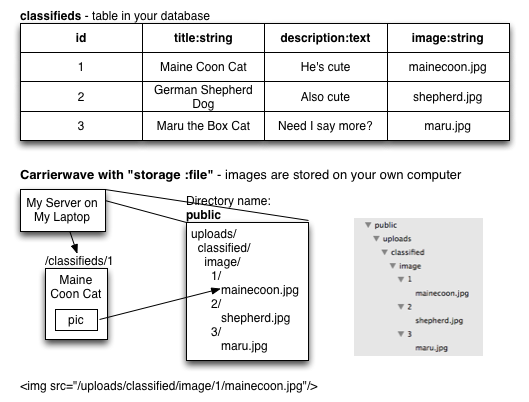
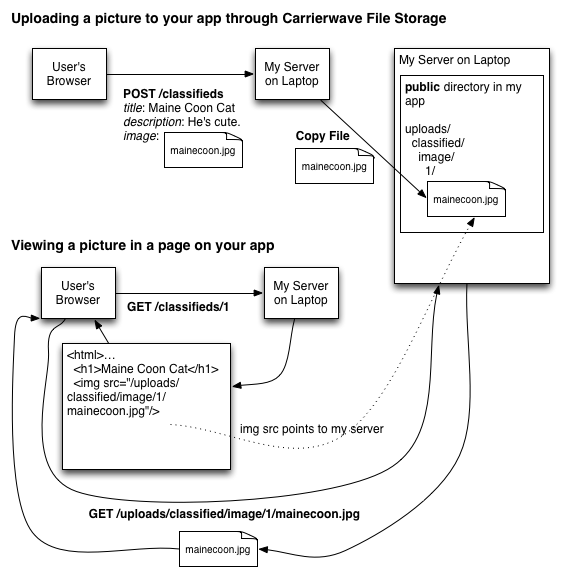
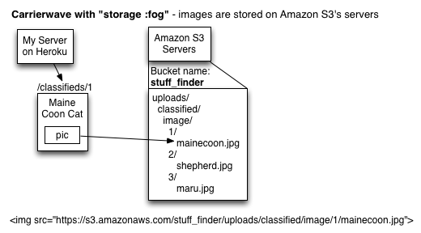
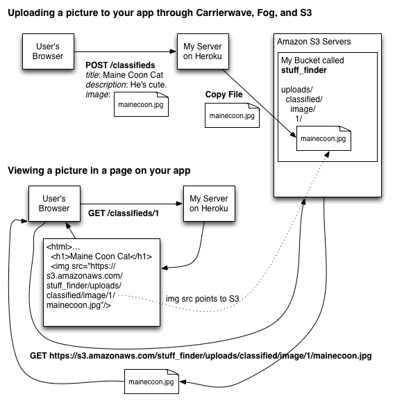

# Class Notes

# Uploading Images to your Models

When you're posting an item on Craigslist, you probably want to upload a photo along with that item so the buyer can see what it looks like.

Members of the Rails community produced a gem called Carrierwave which makes it easy to support this scenario in your app.

With just a few lines of code, your user can upload an image along with any model in your app.

## How Carrierwave works

Imagine a model that has a "title" attribute, a "description" attribute, a "price" attribute. These are strings or integers, but not files.

By adding Carrierwave, any model can have an attribute that stores a file. 

For our classified site, we'll call that attribute "image", and the attribute will represent the image file that the user uploaded.

So when you post a cute cat, you'll create a new classified object, and in the form where you're filling out the title and description, you'll upload a picture that will get stored into the "image" attribute.

Here's how it works:





## Adding Carrierwave to your app

Add it to your Gemfile, like usual:

	gem 'carrierwave'
	
Then do usual:

	$ bundle install
	
So far, we've dealt with Model classes and Controller classes. To use Carrierwave, you need to define a new class called an Uploader. An Uploader defines how the files for a model are stored and processed.

Because we're creating an Uploader for images, we'll call it ``ImageUploader``.

	$ rails generate uploader image
	
Then, we need to add a new column to the model that we're going to be associating images with. This column will be a string, and we'll call it ``image``. It's going to hold the actual name of the file that the user uploaded.

	$ rails g migration add_image_to_classifieds image:string
	
	$ rake db:migrate
	
Of course, if you already have an ``image`` string column in your model, you don't have to add another one.

If you haven't restarted your Rails server, do it now:
	
	restart your rails server
	
## Giving a model the ability to store images

Next, edit your model that's going to hold the images.

	$ subl app/models/classified.rb
	
Add this line to your model class:

	mount_uploader :image, ImageUploader
	
The ``mount_uploader`` function takes two arguments: the name of a database column that will hold the filename, and the name of a Carrierwave Uploader class. 

This means "for this model, the ``image`` attribute should be a Carrierwave file, and it will be controlled by the ``ImageUploader`` class.

## Giving the user the ability to upload images

Now that your model can store images, you need to add a "file upload field" to your form that the user uses to create and edit that model.

Edit the form you're creating with ``form_for``. It's probably in your ``new.html.erb`` and your ``edit.html.erb`` unless you've factored it out into a separate partial file.

	$ subl app/views/classifieds/new.html.erb
	
In the form, add this line:

    <%= f.file_field :image %>

Just like ``text_field`` is for text and ``number_field`` is for numbers, ``file_field`` makes the browser show an 'upload' button that the user can click to pick out a file.

When the user submits the form, the file will be uploaded along with all the other form fields, and it will arrive at the server in the ``params`` hash just like the other form fields.

This means that you need to ``permit`` that new ``image`` field as well. If you don't do this, your files will be uploaded but won't be attached to the model.

In your controller:

	params.require(:classified).permit(:title, :description, :price, :image)
	
When you ``.save`` the model, Carrierwave will take care of all the details of copying the file to a location where it can be accessed through a URL.

If you're using the default ``file`` storage, Carrierwave will copy the file into the ``public`` directory under your app.

If you're using the Amazon S3 ``fog`` storage, which you'll need to do on Heroku, Carrierwave will copy the file to your Amazon S3 bucket. I'll cover that later in these notes.

## Showing the image for a model

Now that the user can upload images and save them along with a model, you can show that picture in any page where you're showing data from that model.

Let's say you want to put it on the ``show`` page for that model.

Say you've got a model object stored in the ``@classified`` variable.

You can show the picture by adding a ```` tag with a ``src`` that points to the URL for that image. You access the URL for the image by calling the ``url`` method on the ``image`` model attribute that holds the file, like this:

	$ subl app/views/classifieds/show.html.erb
	
	<h1><%= @classified.title %></h1>
	…
	"/>
	
That's it! Feel free to style that image to resize it.

Carrierwave can also create thumbnail-size images for you, but read the Carrierwave docs to figure out how. Google for ``rails carrierwave gem``.

## Uploading Files when Your App is On Heroku

Here's an unpleasant fact of life: Heroku can run your app wonderfully, but it can't store files that your users upload.

Instead, you'll need to use a third-party service to hold the files: Amazon S3 (Simple Storage Service). S3 is like Dropbox but used by code instead of people. Your app can upload files to S3 using an API, and every uploaded file can be accessed through a public URL (or a private one if you want).

Here's how your app will use Amazon S3 for file upload:





Carrierwave makes this easy too, but first you need to add the ``fog`` gem.

	$ subl Gemfile
	
	gem 'fog'
	
	$ bundle install
		
``fog`` allows Carrierwave to connect to third-party cloud storage services, like S3. Fog…cloud…ehh. :)

Then, you'll need to sign up for an Amazon S3 account. They'll ask for a credit card, but you can put a pretty large number of files in S3 for free. 

[Sign up for Amazon S3](http://aws.amazon.com/s3)

After you sign up, they'll give you two keys: an ``access key`` and a ``secret access key``. These keys will be necessary to let Carrierwave upload files into your S3 account. 

Both of these keys are long strings of random numbers and letters. Find them and save them somewhere.

Next, you'll need to create a S3 "bucket" to store your files. A bucket is like a top-level S3 directory for you to store files in. The names have to be unique across all S3 users, so name it after your app. Hint: ``stuff_finder`` is already taken. I used it for my app in class. :)

I'd suggest creating your bucket in the "US Standard" region. If you made it somewhere else, you'll have to configure Carrierwave a bit differently.

Then, you'll want to create a second S3 bucket for you to use when you're in development mode on your laptop. This bucket is separate from the bucket that holds files in your production app on Heroku, but it's still on S3. Name it after your app and add ``-dev``, like ``stuff_finder-dev``.

Then, you'll need to configure Carrierwave to know about those keys and buckets in your app. Do that by creating an ``initializer`` for Carrierwave.

	$ subl config/initializers/carrierwave.rb
	
Your file should look like this:

	CarrierWave.configure do |config|
	  config.fog_credentials = {
    	:provider               => 'AWS',
    	:aws_access_key_id      => 'fill in your key here as a string',
    	:aws_secret_access_key  => 'fill in your secret key here as a string',
    	# :region => 'us-west-1' -- only if you're not in US Standard
  	  }  	  
  	  if Rails.env.development?
    	config.fog_directory = 'stuff_finder-dev'
  	  else
        config.fog_directory = 'stuff_finder'
  	  end
	end

The ``fog_credentials``	 should be self-explanatory. The ``if`` statement chooses whether to store files in your development bucket or production bucket depending on whether you're running your app in the development environment (on your laptop) or in production (on Heroku).

Finally, you'll have to change your ImageUploader so it uses ``fog`` instead of ``file`` storage.

	$ subl app/uploaders/image_uploader.rb
	
Change:

	storage :file
	
To:

	storage :fog
	
**NOTE**: Restart your server now. After you've changed initializers and uploaders, you'll need to do that.

The first thing you'll notice is that any previous files you've uploaded will show up as broken links now.

That's because they're only on your local drive, not on S3.

But, now try uploading some new images to your app. They should get pushed up to S3 and it should all work just fine. Carrierwave will automatically copy each file to S3 and put it in the correct directory.

And then when you push your app to Heroku, your app should continue to work just fine when you upload images.


