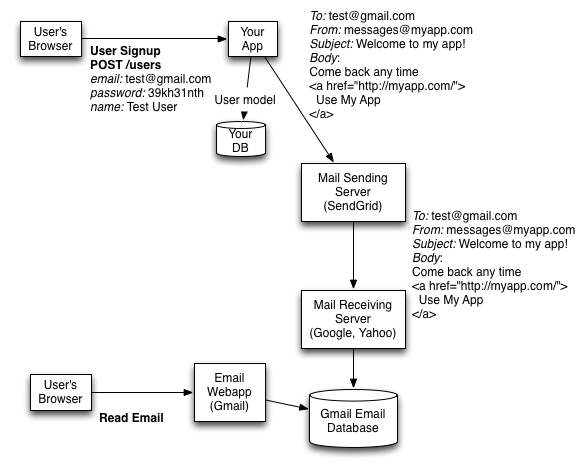
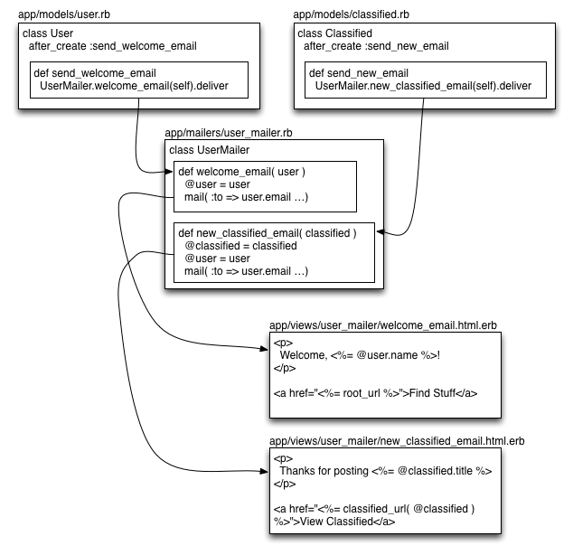

# Class Notes

# Sending Email from your App

When might you want to send an email?

* when a new user signs up for your app, send an email to welcome them
* when a user posts something new, send them an email confirmation
* when a user posts something new, send an email to the site admins to keep them aware
* when a user posts something new, send an email to other users on the site (maybe all users, maybe followers of that user) to let them know that there's something new
* when a user posts a message to another user, send an email to that user letting them know about the message

In all these cases, you'll need to think about three things:

1. What's the trigger for sending the email? (what model is being created or what action is being taken?)
2. Who is the email going to?
3. What's the content of the email?

# How Email Works

To send an email, you need to sign up for an account with an email sending service. For this example, we'll use SendGrid. 

When the trigger happens (user signup, user posts a classified, etc), your Rails app will generate the email "to" address, "from" address, and content, then deliver that to SendGrid using SMTP (Simple Mail Transport Protocol). SendGrid will then deliver the email to the correct email receiving server for that user, so they can read it.



# Signing Up for SendGrid

Heroku lets you sign each of your apps up for SendGrid from the Heroku dashboard. You'll have to do this for each app you want to send email from.

There's a full doc here, which you should also read: [https://devcenter.heroku.com/articles/sendgrid](https://devcenter.heroku.com/articles/sendgrid)

Go to heroku.com, log in, and find your app.

Click "Get Add-Ons", then find SendGrid on that page.

Click the button to add the free tier to your app.

Now you have a SendGrid account that's automatically usable by that app.

Then, on your laptop, in the app directory, run these two commands:

	$ heroku config:get SENDGRID_USERNAME
	appXYZ@heroku.com

	$ heroku config:get SENDGRID_PASSWORD
	password
	
These are your randomly generated SendGrid username and password for this app. Write them down.

# Configuring your app to talk to SendGrid

You'll have to do these steps for each app you want to send email from:

Create a "mail initializer", which configures your app to talk to SendGrid:

	$ subl config/initializers/mail.rb

Put this text in it:

	if Rails.env.production?
		ActionMailer::Base.smtp_settings = {
		  :address        => 'smtp.sendgrid.net',
		  :port           => '587',
		  :authentication => :plain,
		  :user_name      => ENV['SENDGRID_USERNAME'],
		  :password       => ENV['SENDGRID_PASSWORD'],
		  :domain         => 'heroku.com',
		  :enable_starttls_auto => true
		}
  	    ActionMailer::Base.delivery_method = :smtp
	else
		ActionMailer::Base.smtp_settings = {
		  :address        => 'smtp.sendgrid.net',
		  :port           => '587',
		  :authentication => :plain,
	      :user_name      => 'appXYZ@heroku.com',      # fill in your sendgrid username 
	      :password       => 'password',               # fill in your sendgrid password 
		  :domain         => 'heroku.com',
		  :enable_starttls_auto => true
		}
		ActionMailer::Base.delivery_method = :smtp
	end

This initializer tells your app how to connect to SendGrid, and makes it so that when you're running your app in the development environment on your laptop, you can also send emails through SendGrid.

**NOTE**: when you're not testing email sending, you'll want to disable the ability to send email from your app so you don't accidentally bother your users.

Do that by commenting out the stuff in development mode, and changing the delivery to ``:file``, like this:

	if Rails.env.production?
		ActionMailer::Base.smtp_settings = {
		  :address        => 'smtp.sendgrid.net',
		  :port           => '587',
		  :authentication => :plain,
		  :user_name      => ENV['SENDGRID_USERNAME'],
		  :password       => ENV['SENDGRID_PASSWORD'],
		  :domain         => 'heroku.com',
		  :enable_starttls_auto => true
		}
  	    ActionMailer::Base.delivery_method = :smtp
	else
		# ActionMailer::Base.smtp_settings = {
		#   :address        => 'smtp.sendgrid.net',
		#   :port           => '587',
		#   :authentication => :plain,
	    #   :user_name      => 'appXYZ@heroku.com',      # fill in your sendgrid username 
	    #   :password       => 'password',               # fill in your sendgrid password 
		#   :domain         => 'heroku.com',
		#   :enable_starttls_auto => true
	 	# }
	 	# ActionMailer::Base.delivery_method = :smtp
   	    ActionMailer::Base.delivery_method = :file
	end
	
This will still let your app send emails, but it will "deliver" them as text in your server log file, instead of to a real user.

# Configuring your app to send email

First, you need to configure the URL of your app, so that when you include a URL in an email it links back to the right place.

You need to do this once in development (for localhost) and once in production (for your actual URL)

	$ subl config/initializers/development.rb
	
Add this line:

	config.action_mailer.default_url_options = { :host => 'localhost:3000' }

Then:

	$ subl config/initializers/production.rb
	
Add this line, but FILL IN YOUR APP'S REAL URL:

	config.action_mailer.default_url_options = { :host => 'http://yourapp.herokuapp.com' }

**Finally, restart your server because you edited an initializer.**

# Sending Email

Now, you're ready to send email.

We've seen Model classes and Controller classes so far. In Rails, you send email through a Mailer class. 

A Mailer is a lot like a controller. 

You define one method for each email that you can send, like ``welcome_email`` or ``new_classified_email``. 

In that method, you set the "to", the "from", the "subject", and set up any ``@instance`` variables to pass to your view for the body of the email. 

Then, the mailer renders a ``welcome_email.html.erb`` view for the content of the email, and sends it.

The main difference is that instead of being called automatically when the user browses to a page, you have to call the mailer method from somewhere else in your code in order to send the email.

For example, you'll call the ``welcome_email`` method after a new user signs up and a new User model gets created. Or, you'll call the ``new_classified_email`` method after a user posts a clasified and a new Classified model gets created.

Here's how it works:



# Creating a Mailer

Just like a controller. We typically call our mailer ``UserMailer``:

	$ rails generate mailer user

After you generate the email, set the "from" address that all your emails will come from.

	$ subl app/mailers/user_mailer.rb
	
    default from: "messages@myapp.com"

# Defining an email

Add a method to your UserMailer class:

	$ subl app/mailers/user_mailer.rb
	
	def welcome_email(user)
		@user = user
	  	mail( :to => @user.email, :subject => "Thanks for joining Stuff Finder!" )
	end

These methods can take arguments. That's how you pass in data that will need to be in the email.

If you're sending an email about a new user being created, pass in the user model object so you can pull out the email address.

If you're sending an email about a new classified being posted, pass in the Classified model object, then pull out the associated user through an association.

	def new_classified_email(classified)
		@classified = classified
		@user = classified.user
		mail( :to => @user.email, :subject => "You posted a classified on Stuff Finder")
	end
	
Then, write a view for your email. The views go in ``app/views/user_mailer`` and they have the same name as the mailer methods.

	$ subl app/views/user_mailer/welcome_email.html.erb
	
	<p>
		Hi, <%= @user.email %>!
	</p>
	
	<p>
		Thanks for signing up for Stuff Finder. Find stuff any time.
	</p>
	
	<p>
		<a href="<%= root_url %>">Find Stuff</a>
	</p>

**NOTE**: You can use all your usual link helpers in views, like ``root_path``, ``classifieds_path``, ``classified_path(@classified)``, ``new_classified_path``, etc. This is great! Link back to the page for your classified, the user profile page, anything you want.

**BUT**: you have to use the ``_url`` version of the helper, not the ``_path`` version. The ``_url`` version, like ``root_url``, ``classifieds_url``, ``classified_url(@classified)``, ``new_classified_url`` outputs a FULL URL, including the ``http://yourapp.com``` part, so the user can click on it from Gmail and still gets to your site.

# Sending an email

So, we've defined our email.

You can send it by calling the UserMailer method from anywhere in your code:
	
	UserMailer.welcome_email(user_object).deliver
	
Now we need to send it whenever a new user gets created.

The easiest way to do that is by adding an ``after_create`` callback to our User model.

See the Rails Guides for more details on callbacks.

	$ subl app/models/user.rb
	
	class User < ActiveRecord::Base
		…
	    after_create :send_welcome_email

	    def send_welcome_email
	    	UserMailer.welcome_email(self).deliver
	    end
	end
	
When you add an ``after_create`` callback, the argument is the name of the method that should be called after the model gets created and saved to the database.

Because this method is an instance method, ``self`` refers to the User model object that just got created. So we pass ``self`` to our mailer method, and then the mailer method knows which user to send the email to.

If you were doing this for a Classified, it'd be similar:

	$ subl app/models/classified.rb
	
	class Classified < ActiveRecord::Base
		…
	    after_create :send_new_classified_email

	    def send_new_classified_email
	    	UserMailer.new_classified_email(self).deliver
	    end
	end
	
In this case, ``self`` is a Classified model, which is exactly what the ``new_classified_email`` method expects.


